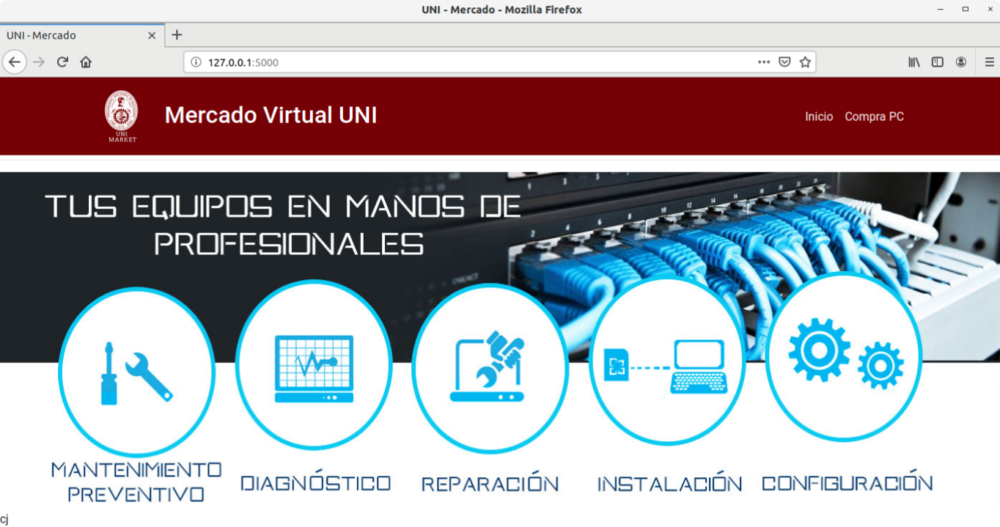
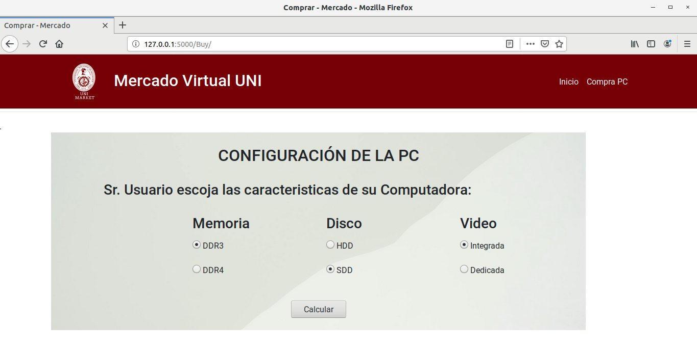

# CompraPC
IOC para la compra de una PC

## Requisitos

Instalar los siguientes paquetes

- pip install flask
- pip install flask-wtf
- pip install flask-bootstrap4

## Instrucciones
- Para Distribuciones Linux: Tener instalado las librerias previas y ejecutar el script
	- $ sh ./run.sh
- Para Windows: Tener instalado las librerias previas y ejecutar los comandos.
	- $ export FLASK_APP=test_main.py
	- $ flask run
## Vistas Previas
- Vista de Interfaz de inicio

- Vista de la Interfaz de compra

- Vista de la Interfaz de Resultados

